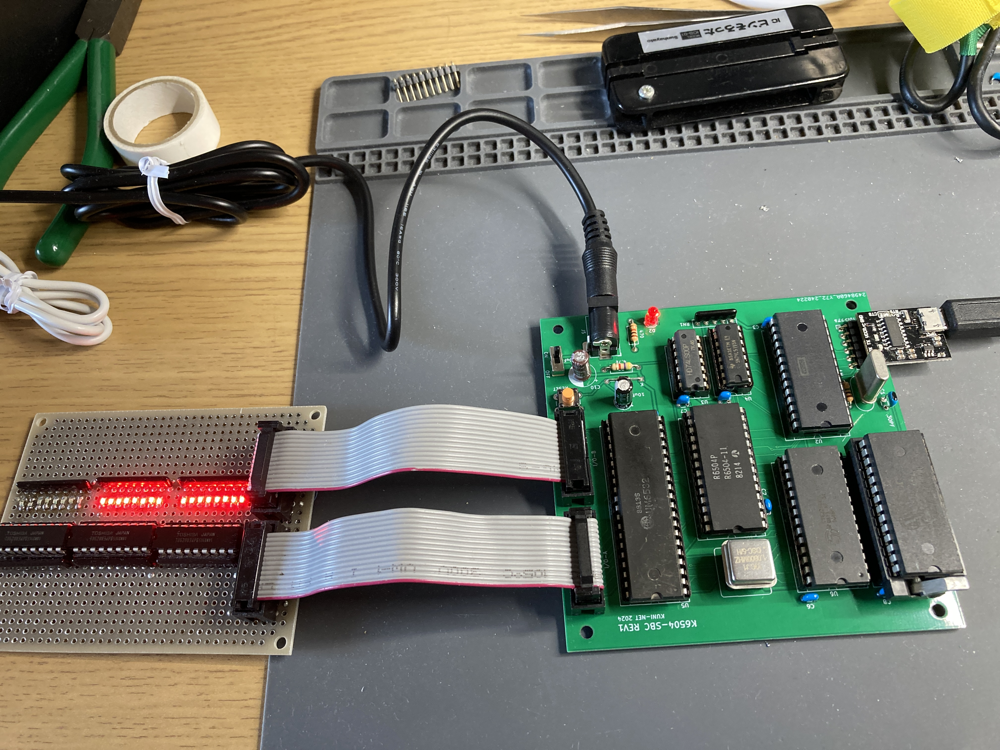

# LEDチカチカ & W65C51経由シリアルへの出力テスト



## 概要

* K6504-SBCの単純な動作確認として使える、LEDチカチカ(1～255カウントアップ)と シリアルへの出力プログラムです。
  * ★ROMに焼いて使用するものです。

## アセンブリと使い方

### ソースからのビルド方法

* Linux等のUNIX環境で [The Macroassembler AS](http://john.ccac.rwth-aachen.de:8000/as/)が動くようにしてください。アセンブリに必要なツールです。
  * 基本的に `Downloadページ` > `latest build`のCソースを持ってきて、gccでmake & make installするだけです。
* Makefileが入ってますので、 `make` コマンドを実行すると `out-6502.hex` ができあがります。TL866 II PlusなどでROMに焼いてお使いください。
  * Universal MonitorのLコマンドでロードしたりして使いたい場合は、先頭アドレス ORGを `$0100` にするなど適宜変更してください。

```
$ make
```
* ビルドしてできたインテルHEXファイルは$1600からのデータとなってます。ROMに焼く際は 適宜ロード先を指定してください。
  * W27C512 : 1600 ⇒ F600 を指定
  * 27C256(UV-EPROM) : 1600 ⇒ 7600 を指定 

### 使い方

* K6504-SBCのI/O端子(14Pボックスヘッダ)経由でLED(8x2セット)を接続してください。
* シリアル端子にはFTDI準拠のUSBシリアル等を接続してください。
  * TeraTerm等の設定は9600bpsに設定してください。
* ROMに焼いた等プログラムをK6504-SBCに装着して電源ONすると、LEDがバイナリで1～255まで順次カウントアップします。また同じデータをシリアル端子にも出力します。(なんでもかんでもシリアルに出力するので文字化けするかも)
