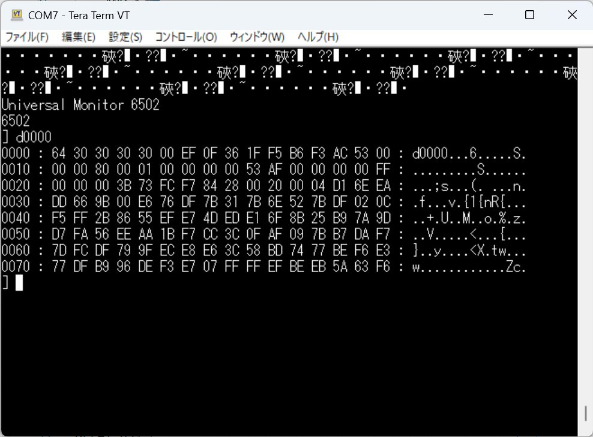
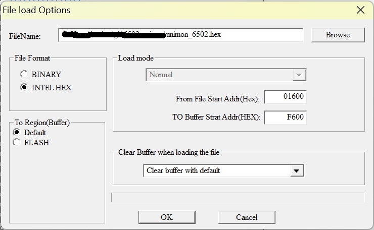

# Universal Monitor関係

## 概要

* K6504-SBCで動くUniversal MonitorのROMイメージをビルドするために必要なファイルです。

## サンプルとして含まれるファイル

|ファイル名|説明|
|:--|:--|
|config.K6504-SBC|K6504-SBC用configファイル|
|dev_6551.asm|K6504-SBCのACIA(W65C51)対応コンソールドライバ|

## ビルドの注意

* Universal Monitorのソースを展開してでてくるなかの `6502` フォルダのソースを使ってください。
* `dev_6551.asm` をでコンソールドライバとして使ってください。(W65C51バグ対応版です。)
  * TeraTermで9600bpsで通信可能です。
* ACIA(W65C51)のアドレス等は `config.K6504-SBC` に書いてます。congih.incとしてお使いください。
* ビルドしてできたインテルHEXファイルは$1600からのデータとなってます。ROMに焼く際は 適宜ロード先を指定してください。
  * W27C512 : 1600 ⇒ F600 を指定
  * 27C256(UV-EPROM) : 1600 ⇒ 7600 を指定 

## 参考

* UniversalMonitor > ビルド
  * https://electrelic.com/electrelic/node/1395
